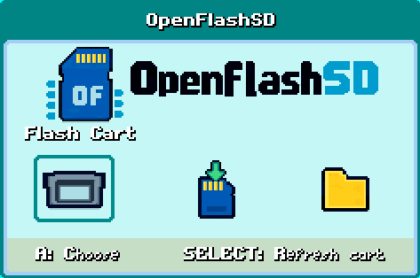
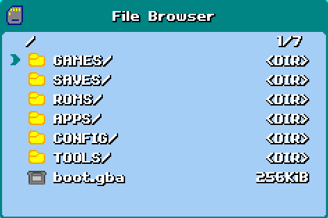
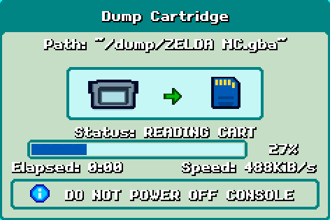
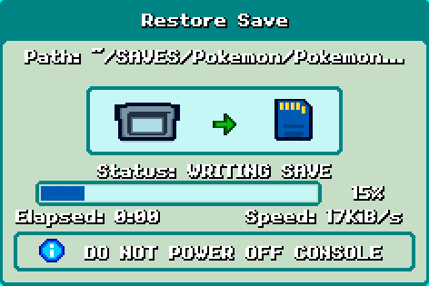
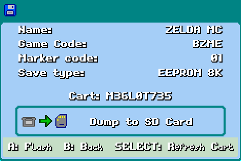
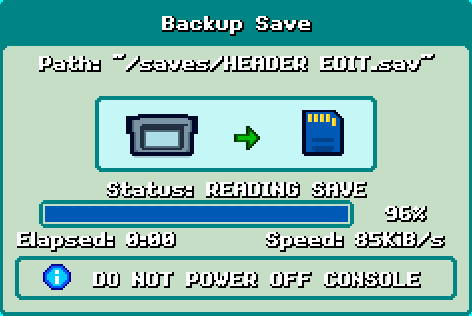
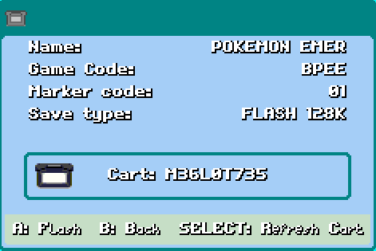
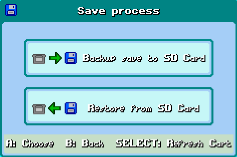

## OpenFlashSD - GBA Cart flasher via SDCard and ESP32

### Working GBA frontend/screens side
    - File browser
    - Flashing rom
    - Dump cartridge
    - Backup/restore save

### Working ESP32 side
    - receive PING packet
    - respond PONG to GBA

## Pictures of GBA Side

# TODO
- Make ESP32 take all the remaining command as only PING works for now
- Wire the two side for the rest of the commands